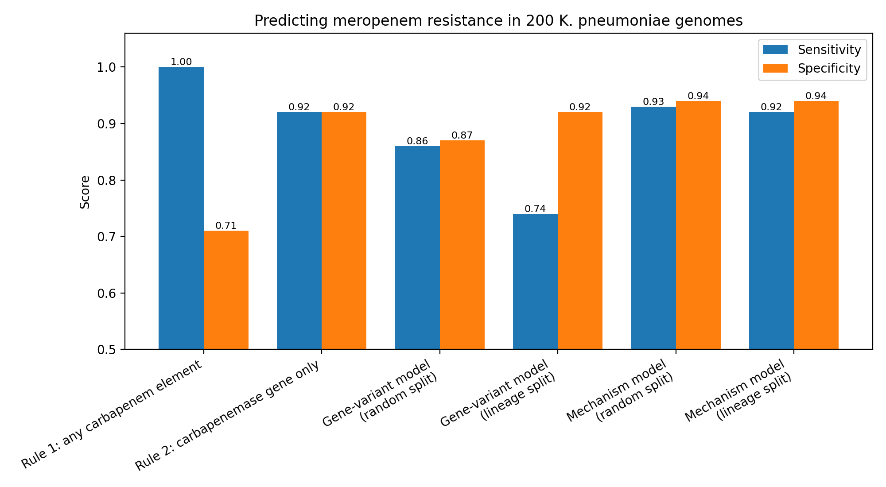
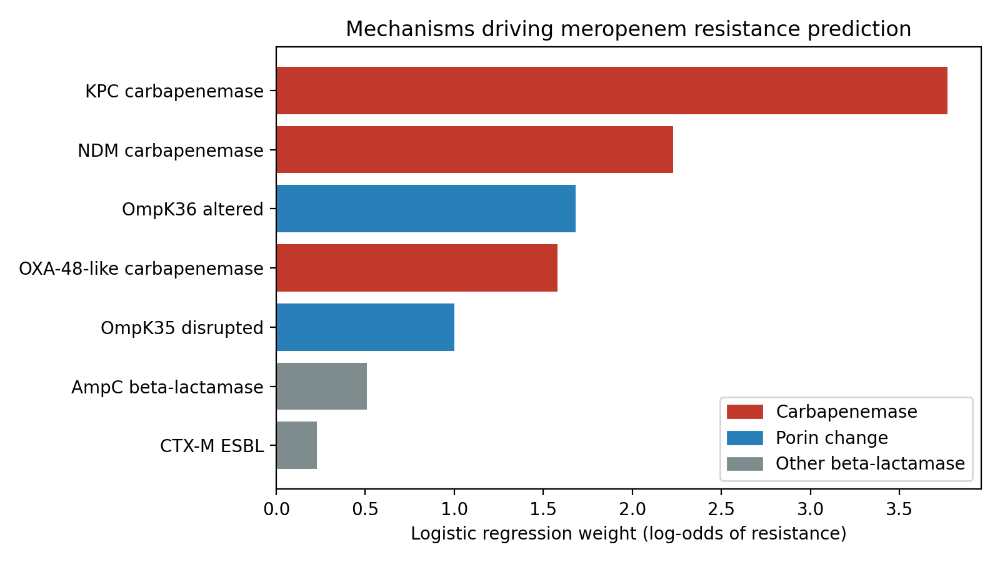

# Predicting meropenem resistance in *Klebsiella pneumoniae* from genome sequences

Can we predict whether a *Klebsiella pneumoniae* isolate is resistant to meropenem using only its genome — and does that prediction still work on bacterial lineages the model has never seen?

This project builds an end-to-end pipeline on public data: it collects and cleans laboratory susceptibility results from BV-BRC, scans 200 genomes for resistance genes and mutations with NCBI AMRFinderPlus, and compares simple rules against machine learning models using a lineage-aware evaluation.

## Key findings

- **Known mechanisms explain almost all resistance.** Every one of the 100 resistant isolates carried at least one carbapenem-associated gene or mutation.
- **A carbapenemase-only rule is a strong baseline** (sensitivity 0.92, specificity 0.92). Counting porin mutations as well catches every resistant isolate but raises false alarms sharply (specificity 0.71).
- **How the data is described matters more than the algorithm.** A logistic regression trained on individual gene variants (e.g. *bla*KPC-2 and *bla*KPC-3 as separate features) performed worse than the simple rule, and its sensitivity fell from 0.86 to 0.74 when tested on unseen lineages. The same model trained on mechanism-level features (e.g. "any KPC") reached sensitivity 0.92 and specificity 0.94 on unseen lineages, with almost no drop from the random split.
- **The model recovered known biology without being told it:** KPC alone is sufficient for resistance, OXA-48 alone usually is not but becomes sufficient with porin damage, and an ESBL combined with damage to both major porins can cause resistance without any carbapenemase.



*Sensitivity and specificity for each approach (n = 200 genomes). Note that the y-axis starts at 0.5, which makes small differences look larger.*



*Logistic regression weights for the mechanism-level model, trained on all 200 genomes. VIM/IMP carbapenemases are omitted because at most one genome carried them, so their weight is not meaningful.*

## Data

All data are public and come from [BV-BRC](https://www.bv-brc.org) (Bacterial and Viral Bioinformatics Resource Center).

**Phenotypes.** I retrieved all *K. pneumoniae* (taxon 573) meropenem records via the BV-BRC API, keeping only laboratory-measured results and excluding BV-BRC's computational predictions. This gave 6,225 records.

**Label cleaning.**
- About a third of records (2,013) had no resistant/susceptible label but did have a measured MIC. I re-interpreted every available MIC with current CLSI breakpoints for Enterobacterales (susceptible ≤ 1 mg/L, intermediate 2 mg/L, resistant ≥ 4 mg/L), so all labels follow one consistent standard. Where an MIC could not be classified unambiguously (e.g. "≤ 4"), I kept the database label instead of guessing.
- Comparing my labels with the database's labels showed 2,628 agreements and 25 disagreements, all in the direction expected from the 2010 lowering of the CLSI carbapenem breakpoints (older records labelled with the earlier, more lenient cutoffs).
- Six disk-diffusion measurements (in mm) were excluded from MIC interpretation, as they are not MIC values.
- Intermediate results (253) were removed to make a binary resistant/susceptible problem, and 7 genomes with contradictory repeat results were removed.
- **Result: 5,820 genomes with one consistent label** (3,625 susceptible, 2,195 resistant).

**Genome quality control.** Using BV-BRC metadata, I kept genomes with a "Good" quality rating, ≤ 300 contigs, a total length of 5.0–6.5 Mb, CheckM completeness ≥ 95% and contamination ≤ 5%. 5,480 of 5,820 genomes (94%) passed.

**Study set.** From the genomes passing QC, I randomly selected 100 resistant and 100 susceptible genomes (fixed random seed, so the selection is reproducible). The 200 genomes span 75 sequence types; the most common are ST258 (24), ST307 (19), ST512 (16), ST15 (14) and ST11 (11), all recognised high-risk clones.

## Methods

**Resistance gene detection.** Each genome assembly was downloaded from BV-BRC and scanned with NCBI AMRFinderPlus v4.2.7 (database version 2026-08-07.1) in nucleotide mode with `--organism Klebsiella_pneumoniae`, which also checks species-specific point mutations (e.g. in the porin genes *ompK35* and *ompK36*). To keep storage small, genomes were processed one at a time: download, scan, save the result table, delete the genome. The loop is resumable, so it can continue after a Colab session ends.

**Feature tables.**
- *Gene-variant features:* one binary column per gene or mutation detected, after removing elements found in fewer than two genomes or in every genome.
- *Mechanism features:* eight biologically defined groups: KPC, NDM, OXA-48-like and VIM/IMP carbapenemases; CTX-M ESBLs; AmpC enzymes (CMY, DHA); OmpK35 disrupted (frameshift or premature stop mutations only); and any OmpK36 alteration.

**Models and evaluation.**
- *Rule 1:* resistant if any carbapenem-associated element is present (any carbapenemase or porin mutation flagged by AMRFinderPlus).
- *Rule 2:* resistant if any carbapenemase gene is present.
- *Logistic regression* (scikit-learn, default L2 regularization), evaluated with 5-fold stratified cross-validation, so every genome is predicted by a model that never saw it during training.
- **Two cross-validation schemes:** a *random split*, and a *lineage split* (`StratifiedGroupKFold`) in which all genomes of a sequence type are held out together. The lineage split tests whether a model generalises to unseen lineages rather than recognising relatives of training isolates.

## Results

| Approach | Split | Sensitivity | Specificity | Accuracy |
|---|---|---|---|---|
| Rule 1: any carbapenem element | none | 1.00 | 0.71 | 0.855 |
| Rule 2: carbapenemase gene only | none | 0.92 | 0.92 | 0.920 |
| Gene-variant model | random | 0.86 | 0.87 | 0.865 |
| Gene-variant model | lineage | 0.74 | 0.92 | 0.830 |
| Mechanism model | random | 0.93 | 0.94 | 0.935 |
| Mechanism model | lineage | 0.92 | 0.94 | 0.930 |

Sensitivity is the fraction of resistant isolates correctly identified. In a clinical setting it is the most important measure, because calling a resistant infection susceptible means a patient may receive an antibiotic that will not work.

### Why Rule 1 raises false alarms

Rule 1 flagged 29 susceptible isolates as resistant. About 21 of these carried only porin mutations, mostly in OmpK35, which on their own rarely raise the meropenem MIC above the resistance breakpoint. One OmpK35 substitution, E132K, was found in 21% of these false alarms but in none of the resistant isolates. The remaining false alarms carried a carbapenemase, most often OXA-48 (5 isolates), a weak carbapenemase that frequently gives MICs below the breakpoint when no other mechanism is present.

The false alarms also frequently carried fluoroquinolone resistance mutations (*gyrA*, *parC*) and class 1 integron markers (*sul1*, *qacEΔ1*, *dfrA12*). These have no direct link to carbapenems; they indicate that the false alarms belong to the same multidrug-resistant lineages as the resistant isolates. This shared ancestry is exactly what a model could exploit as a shortcut, which is why the lineage split matters.

### Resistant isolates without a carbapenemase

Eight resistant isolates carried no carbapenemase gene:
- **Three** fit the classic carbapenemase-independent route: an ESBL (CTX-M-15 or SHV-12) combined with porin damage.
- **Two** of those three also carry a beta-lactamase reported only as *bla*OXA without an assigned variant, which can indicate a gene split across contigs. Whether it is a carbapenemase remains an open question.
- **About four** are not explained by the detected elements. Possible causes include porin disruption by insertion sequences or regulatory changes (which AMRFinderPlus does not detect), increased efflux, beta-lactamase gene amplification, or MIC measurement variability near the breakpoint.

### What the model learned

| Genome carries | Predicted probability of resistance |
|---|---|
| None of the mechanisms | 7% |
| KPC only | 77% |
| OXA-48-like only | 27% |
| OXA-48-like + disrupted OmpK35 | 50% |
| OXA-48-like + disrupted OmpK35 + altered OmpK36 | 84% |
| CTX-M + disrupted OmpK35 + altered OmpK36 (no carbapenemase) | 58% |

## Limitations

- **Small sample.** With 200 genomes, the difference between the mechanism model and Rule 2 amounts to one or two isolates and is not statistically meaningful. The robust findings are the contrast between gene-variant and mechanism features, and the stability of the mechanism model across lineages.
- **Lineage grouping is by sequence type, not clonal group.** ST258, ST512 and ST11 belong to the same clonal group, so the lineage split still lets the model see close relatives during training. Grouping by clonal group would be a stricter test.
- **Feature definitions were partly informed by the data.** Restricting OmpK35 to disruptive mutations is a standard biological rule, but the choice was made after exploring this dataset, which may slightly flatter the result.
- **Regularization shrinks weights for rare mechanisms.** NDM (about 16 genomes) receives a lower weight than its biology suggests, and the VIM/IMP weight is uninterpretable.
- **AMRFinderPlus detects known genes and point mutations only.** Insertion-sequence disruptions, expression changes and copy-number effects are invisible to this pipeline.
- **Weights show association, not causation.** For example, the OmpK36 weight likely reflects real biology but also its co-occurrence with KPC in the ST258 family.
- **One antibiotic, one species.** The pipeline is general, but results apply only to meropenem in *K. pneumoniae*.

## Repository structure

```
kpneumo-amr-prediction/
├── notebooks/
│   ├── 01_fetch_data.ipynb        # download and clean BV-BRC phenotypes
│   ├── 02_get_genomes.ipynb       # quality control, genome selection, AMRFinderPlus scanning
│   ├── 03_build_gene_table.ipynb  # combine scan results into a genome × gene table
│   └── 04_model.ipynb             # rules, models, evaluation and figures
├── data/
│   ├── meropenem_labels_clean.csv
│   ├── scan_list_200.csv
│   ├── gene_table_200.csv
│   └── results_summary.csv
├── figures/
│   ├── model_comparison.png
│   └── mechanism_weights.png
└── README.md
```

## Reproducing the analysis

The notebooks run in Google Colab and store their outputs in a Google Drive folder. Run them in numbered order. AMRFinderPlus is installed from Bioconda inside notebook 02; scanning 200 genomes takes several hours on a free Colab instance and resumes automatically if the session disconnects.

## Tools

Python (pandas, NumPy, scikit-learn, matplotlib, requests), NCBI AMRFinderPlus v4.2.7, BV-BRC API, Google Colab.

## References

- Olson RD, *et al.* Introducing the Bacterial and Viral Bioinformatics Resource Center (BV-BRC). *Nucleic Acids Research* (2023).
- Feldgarden M, *et al.* AMRFinderPlus and the Reference Gene Catalog facilitate examination of the genomic links among antimicrobial resistance, stress response, and virulence. *Scientific Reports* 11, 12728 (2021). doi:10.1038/s41598-021-91456-0
- CLSI. *Performance Standards for Antimicrobial Susceptibility Testing* (M100). Clinical and Laboratory Standards Institute.

## Author

Alaa Hamid, computational biologist. www.linkedin.com/in/alaa-hamid-33a820218
